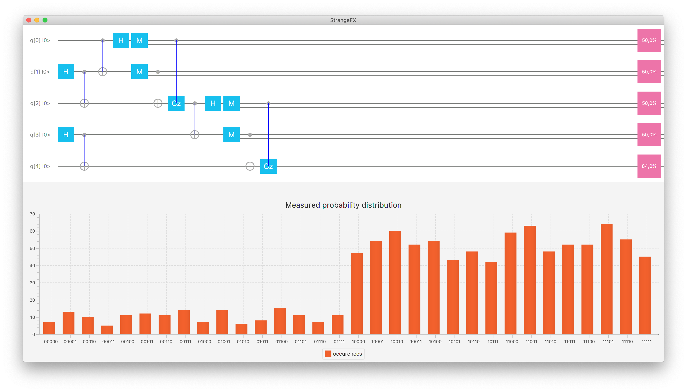

# Quantum repeater

This sample extends quantum teleportation over a number of nodes, that can act as a quantum repeater

# Running the sample

To run this application, simply run
`mvn clean javafx:run`

The console output contains the number of times a specific outcome is measured
```
cnt [0]: 4
cnt [1]: 8
cnt [2]: 7
cnt [3]: 7
cnt [4]: 9
cnt [5]: 10
cnt [6]: 5
cnt [7]: 7
cnt [8]: 10
cnt [9]: 5
cnt [10]: 10
cnt [11]: 19
cnt [12]: 10
cnt [13]: 10
cnt [14]: 13
cnt [15]: 11
cnt [16]: 53
cnt [17]: 41
cnt [18]: 39
cnt [19]: 50
cnt [20]: 53
cnt [21]: 61
cnt [22]: 63
cnt [23]: 52
cnt [24]: 59
cnt [25]: 56
cnt [26]: 50
cnt [27]: 52
cnt [28]: 49
cnt [29]: 63
cnt [30]: 59
cnt [31]: 55

```
This is shown more clearly in the following that is also shown:



# What it is doing

In this sample, we send a qubit from Alice to Bob via a node in the middle
Note that the initial probability of the qubit is artifically set in the program to 16%, and the qubit
ultimately measured by Bob will have the same probability.

You can learn more about this sample in Chapter 6 of [Quantum Computing for Java Developers](https://www.manning.com/books/quantum-computing-for-java-developers?a_aid=quantumjava&a_bid=e5166ab9). It is discussed in 6.5: "A Quantum repeater"
