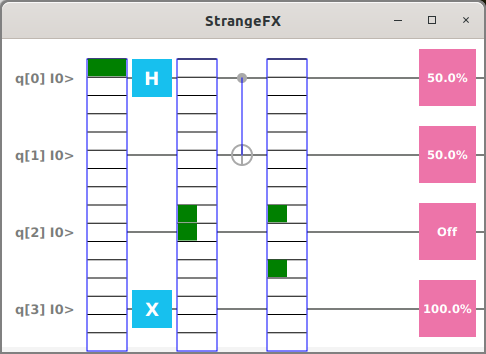

# RandomBit with debug

This sample shows how to visualise intermediate probabilities using StrangeFX

# Running the sample

To run this application, simply run
`mvn clean javafx:run`

The expected outcome on the console looks like this:

```
Qubit[0]: 1
Qubit[1]: 1
Qubit[2]: 0
Qubit[3]: 1
```

Apart from this, the quantum circuit is shown and it now includes the
probability vector after each step.


# What it is doing

This sample shows how using StrangeFX allows you to understand the
intermediate states of a quantum circuit.

You can learn more about this sample in Chapter 7 of [Quantum Computing for Java Developers](https://www.manning.com/books/quantum-computing-for-java-developers?a_aid=quantumjava&a_bid=e5166ab9). It is discussed in 7.5.2: "Debugging Strange code"
