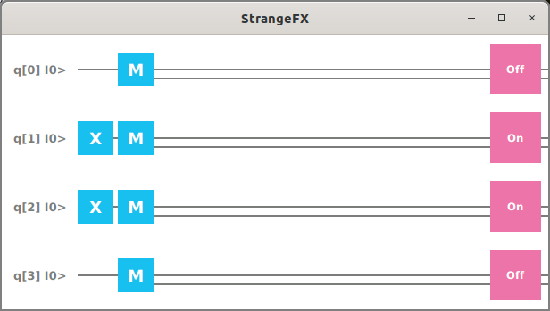

# Naive secret key

This code shows a first attempt by Alice and Bob to create a shared secret key

# Running the sample

To run this application, simply run
`mvn clean javafx:run`

The expected outcome on the console looks similar to this

```
Alice sent 0 and Bob received 0
Alice sent 1 and Bob received 1
Alice sent 1 and Bob received 1
Alice sent 0 and Bob received 0

```

The circuit that is used to generate this is shown below:



# What it is doing

Alice generates a "secret" key by randomly putting qubits in either the |0> or the |1>
state. She sends the qubits to Bob, who measures them. We call this the naive sample,
as an eavesdropper can easily intercepts the key without leaving a trace.

You can learn more about this sample in Chapter 8 of [Quantum Computing for Java Developers](https://www.manning.com/books/quantum-computing-for-java-developers?a_aid=quantumjava&a_bid=e5166ab9). It is discussed in 8.3: "Naive approach"
