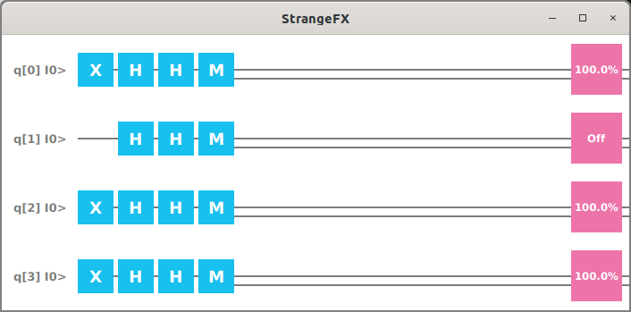

# Superposition

This code shows a second attempt by Alice and Bob to create a shared secret key.

# Running the sample

To run this application, simply run
`mvn clean javafx:run`

The expected outcome on the console looks similar to this

```
Alice sent 1 and Bob received 1
Alice sent 0 and Bob received 0
Alice sent 1 and Bob received 1
Alice sent 1 and Bob received 1

```

The circuit that is used to generate this is shown below:



# What it is doing

Alice generates a "secret" key by randomly putting qubits in either the |0> or the |1>
state. Before she sends the qubits to Bob, she applies a Hadamard gate to them so that
the qubits are in a superposition state. Before Bob measures them, he applies another
Hadamard gate so that the qubit returns to the original status.
An eavesdropper can still spy on Alice and Bob, if she knows that Alice and Bob are using
this approach.

You can learn more about this sample in Chapter 8 of [Quantum Computing for Java Developers](https://www.manning.com/books/quantum-computing-for-java-developers?a_aid=quantumjava&a_bid=e5166ab9). It is discussed in 8.4: "Leveraging superposition"
