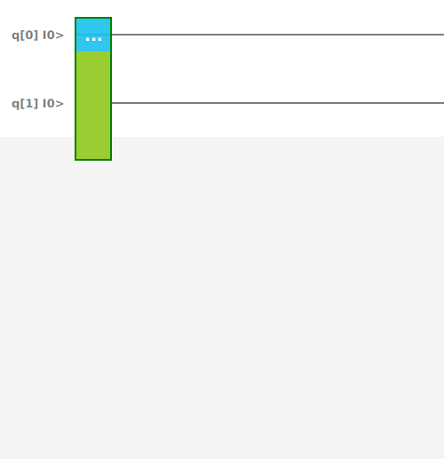

# Applying a Quantum Oracle

This code shows how 4 different Oracles, representing 4 classical functions, act when 
being applied to different input states.

# Running the sample

To run this application, simply run
`mvn clean javafx:run`

The result of this application is similar to the output below
```
Use 00 as input
C, measured = 0, 0
B, measured = 0, 0
B, measured = 1, 0
C, measured = 1, 0

Use 01 as input
C, measured = 1, 0
B, measured = 1, 0
B, measured = 0, 0
C, measured = 0, 0

Use 10 as input
C, measured = 0, 1
B, measured = 1, 1
B, measured = 0, 1
C, measured = 1, 1

Use 11 as input
C, measured = 1, 1
B, measured = 0, 1
B, measured = 1, 1
C, measured = 0, 1
```

Also, the following quantum circuit and probability chart are shown:




# What it is doing

With 4 possible input states and 4 oracles, we have 16 possible combinations. This samples calculates them
and shows how it matches with classical balanced or constant functions.
You can learn more about this sample in Chapter 9 of [Quantum Computing for Java Developers](https://www.manning.com/books/quantum-computing-for-java-developers?a_aid=quantumjava&a_bid=e5166ab9). It is discussed in 9.6: "Deutsch algorithm".
