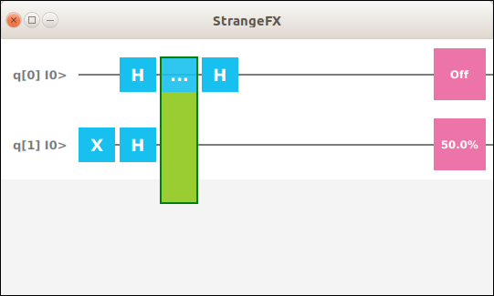

# Deutsch 

This code demonstrates the Deutsch algorithm

# Running the sample

To run this application, simply run
`mvn clean javafx:run`

The result of this application is similar to the output below
```
f = 4, val = 0
f = 4, val = 0
f = 4, val = 0
f = 4, val = 0
f = 3, val = 1
f = 2, val = 1
f = 2, val = 1
f = 4, val = 0
f = 3, val = 1
f = 4, val = 0
```

Also, the following quantum circuit and probability chart are shown:




# What it is doing

This sample shows how the Deutsch algorithm needs a single evaluation only to determine if a quantum
oracle represents a classic constant or balanced function.

You can learn more about this sample in Chapter 9 of [Quantum Computing for Java Developers](https://www.manning.com/books/quantum-computing-for-java-developers?a_aid=quantumjava&a_bid=e5166ab9). It is discussed in 9.6: "Deutsch algorithm".
